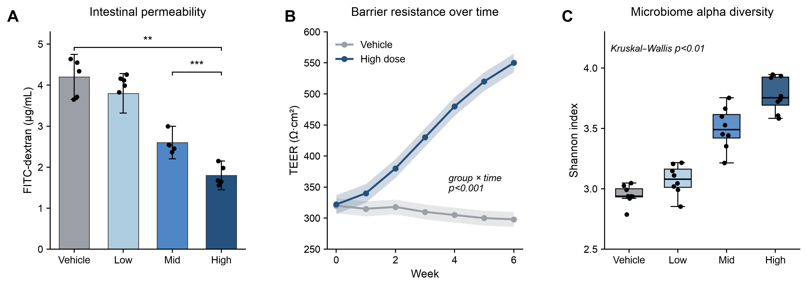
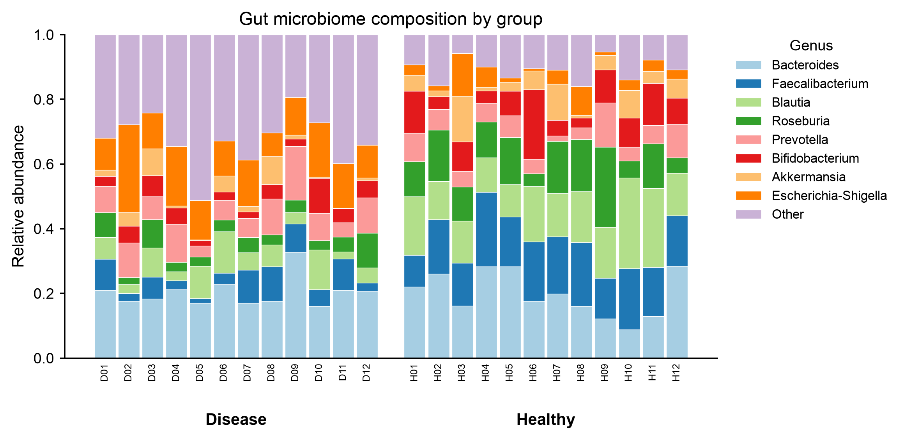
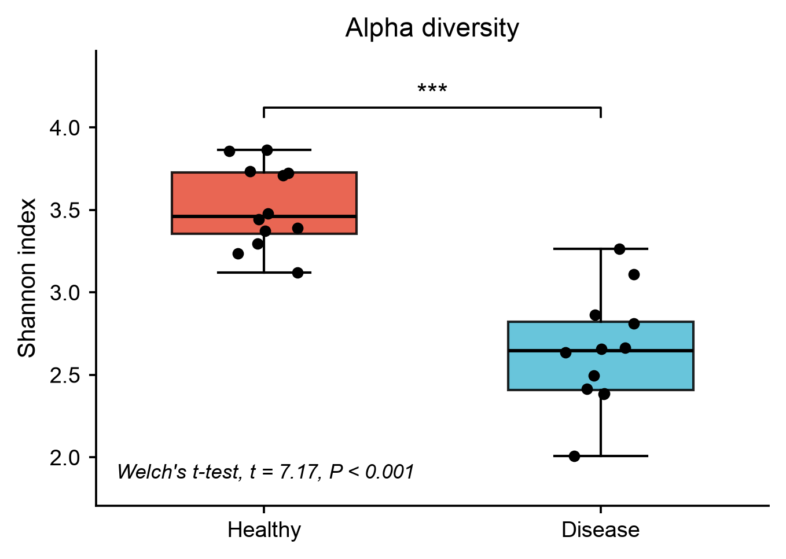
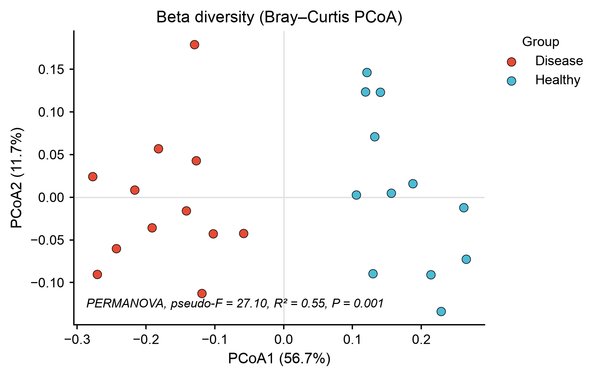
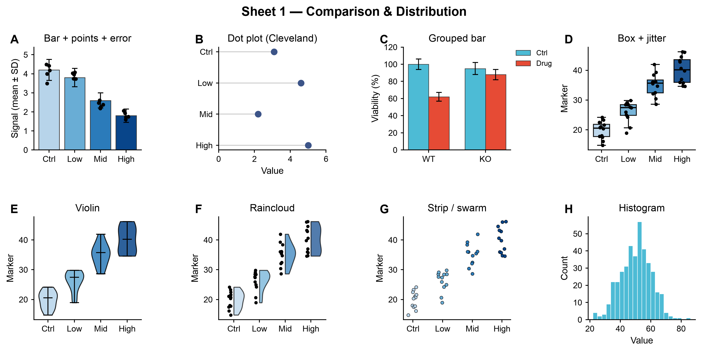
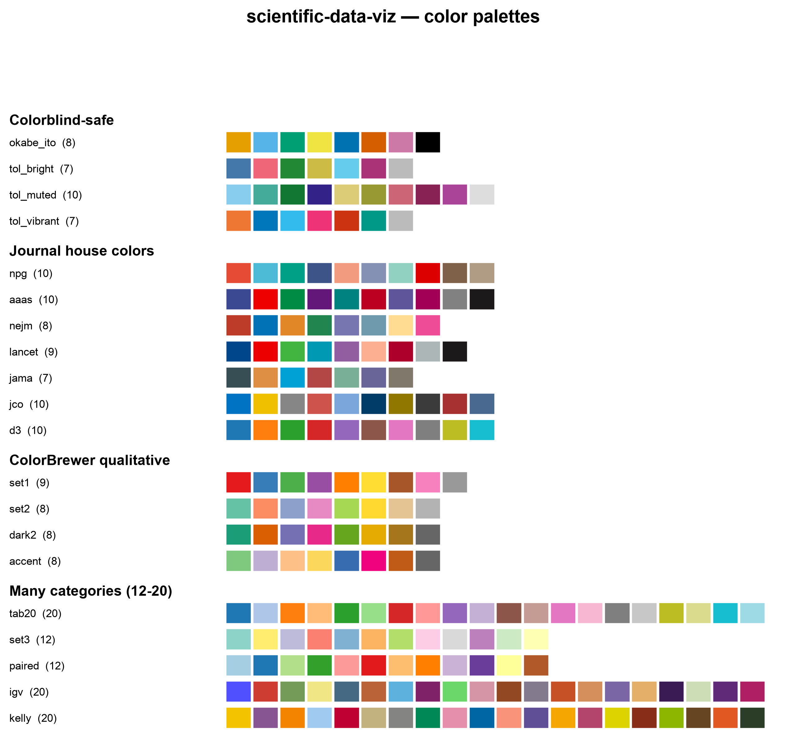

<div align="center">

# 📊 scientific-data-viz

### 実データ → 論文投稿レベルのジャーナル図。**AIの推測ではなく、正確な値を。**

[English](README.md) · [한국어](README.ko.md) · **日本語** · [中文](README.zh.md) · [Español](README.es.md)

<p>
  
  
  
  
  
</p>

データを **Nature / Cell / eLife スタイル** の図に変換する **Claude Code スキル** —
`matplotlib` による **コード描画** なので、すべての棒・点・誤差棒があなたの数値と一致します。



</div>

---

> [!IMPORTANT]
> **これはAI画像生成ツールではありません。** 画像モデルは棒の高さ・軸・誤差棒を
> でっち上げます。このスキルは *プロット用のコードを書き*、あなたの **正確な** 値を
> 洗練されたジャーナルスタイルで描画します。そして編集可能なベクター **PDF** と
> 再現可能な **スクリプト** を出力します。

---

## ✨ 特徴

|  |  |
|---|---|
| 🎯 **適切なプロットを自動で** | 意図ベースのガイドがデータの形状を最も明快なチャートに対応づけます |
| 🧑‍🔬 **ジャーナルのハウススタイル** | 白背景、余計な装飾なし、太字のパネル記号、塗りつぶしの点、編集可能なPDF |
| 🔢 **正確な値** | 棒はゼロから始まり、誤差の種類（SD/SEM/CI）を明記、平滑化も捏造もなし |
| 🎨 **20種のカラーパレット** | 色覚多様性に配慮 · ジャーナル（NPG/AAAS/NEJM/Lancet/JAMA）· 多カテゴリ（tab20/igv/kelly） |
| 📐 **凡例は外側に** | データと決して重なりません |
| 📈 **オプションの統計** | t / ANOVA / Mann–Whitney / Kruskal / 相関 / log-rank / **PERMANOVA**、検定名を省略せず記載 |
| 🔗 **テーブル + メタデータ** | 特徴量テーブルとメタデータファイルを `sample_id` で結合（オミクス形式） |
| 📁 **構造化された出力** | `images/*.png,*.pdf` + `script/*.py` |

---

## 🖼️ 例

<div align="center">

**分類群の棒グラフ** — 多カテゴリパレット、凡例はプロットの外側



<table>
  <tr>
    <td width="50%" valign="top">
      
      <br/><sub><b>アルファ多様性</b> — ボックス + 点、<b>計算された</b>検定を省略せず記載</sub>
    </td>
    <td width="50%" valign="top">
      
      <br/><sub><b>ベータ多様性（PCoA）</b> — % 分散軸 + <b>PERMANOVA</b></sub>
    </td>
  </tr>
</table>

**組み込みプロットカタログの1ページ** &nbsp;·&nbsp; **20パレットのスウォッチ**




</div>

---

## 🤖 これは何か？

`scientific-data-viz` は [Claude Code](https://docs.anthropic.com/en/docs/claude-code) 向けの **スキル** です —
CLIを実行するのではなく、単に **データや図を説明する** だけで Claude がスキルを読み込みます。
起動のきっかけとなるプロンプト：

```text
"make a publication figure from this CSV"
"draw a journal-style taxonomy bar plot / PCoA"
"plot a Kaplan–Meier / forest plot / heatmap for my paper"
```

---

## 🚀 インストール

**1. Claude Code にプラグインを追加**

```bash
/plugin marketplace add chanikyu/scientific-data-viz
/plugin install scientific-data-viz
```

**2. Python の依存関係**（初回使用時に venv が作成されます。手動でセットアップも可）

```bash
python3 -m venv venv
./venv/bin/pip install -r skills/scientific-data-viz/requirements.txt
```

`matplotlib`、`numpy`、`scipy`、`pandas`、`squarify` が必要です。

---

## 🧬 使い方

やりたいことを説明すると、スキルは決まったワークフローを実行します：

1. **取り込みと確認** — 型、サンプルサイズ、対応あり/縦断、不確実性。単一のテーブル、**または**
   `sample_id` で結合された特徴量テーブル **+ 別のメタデータファイル** を受け付けます。
2. 選択ガイド（`plot-selection.md`）で **プロットを選択**。
3. **どのパレットにするか質問**（20パレットのスウォッチを表示、デフォルトは `tab20`）。
4. **（オプション）統計** — 要求した場合、または生の反復データを提供した場合のみ。
5. ジャーナルスタイルで **描画**、凡例は外側。
6. **出力** `images/<name>.png`（300 dpi）+ `images/<name>.pdf`（ベクター）+ `script/<name>.py`。
7. どのプロット・パレット・誤差の種類・検定を使ったかを **報告**。

### 📈 統計（オプトイン）— **完全な検定名** で注記

| 状況 | 検定 | 注記 |
|---|---|---|
| 2群、独立 | Welch's t-test / Mann–Whitney U | `Welch's t-test, t = 7.17, P < 0.001` |
| 2群、対応あり | paired t-test / Wilcoxon signed-rank | `Wilcoxon signed-rank test, W = 3.0, P = 0.002` |
| 3群以上 | one-way ANOVA / Kruskal–Wallis (+ Holm posthoc) | `one-way ANOVA, F(3, 28) = 12.40, P < 0.001` |
| 相関 | Pearson / Spearman | `Pearson correlation, r = 0.99, P < 0.001` |
| 生存 | log-rank | `log-rank test, chi2(1) = 6.1, P = 0.013` |
| ベータ多様性 | **PERMANOVA** | `PERMANOVA, pseudo-F = 27.10, R² = 0.55, P = 0.001` |

パラメトリックか非パラメトリックかは Shapiro–Wilk 正規性検定で自動判定され、報告されます。
このスキルが検定をでっち上げたり、有意性を捏造することは決してありません。

---

## 📚 対応プロット

`比較` bar+points · dot · grouped bar &nbsp;|&nbsp;
`分布` box · violin · raincloud · strip/swarm · histogram · KDE · ECDF &nbsp;|&nbsp;
`関係` scatter+fit+CI · bubble · hexbin &nbsp;|&nbsp;
`トレンド` line+band · multi-line · area &nbsp;|&nbsp;
`構成` stacked · 100%-stacked · treemap · pie &nbsp;|&nbsp;
`ランキング` ordered bar · lollipop &nbsp;|&nbsp;
`対応` slope · difference &nbsp;|&nbsp;
`効果量` forest / coefficient &nbsp;|&nbsp;
`行列` heatmap · clustermap · mosaic &nbsp;|&nbsp;
`生存` Kaplan–Meier · cumulative incidence &nbsp;|&nbsp;
`一致度` Bland–Altman &nbsp;|&nbsp;
`多変量` PCA · UMAP · PCoA &nbsp;|&nbsp;
`フロー` Sankey/alluvial · chord

スタイルモジュールは **あらゆる** matplotlib プロットで機能します — これは厳選され、意図に対応づけられたセットにすぎません。

---

## 🗂️ リポジトリ構成

```
.claude-plugin/plugin.json        plugin manifest
skills/scientific-data-viz/
  SKILL.md                        workflow + rules (skill entry point)
  plot-selection.md               data-nature -> best-plot guide
  journal_style.py                house-style module (palettes, legends, helpers)
  stats.py                        optional tests + PCoA / PERMANOVA
  palette_reference.py / .png     the 20-palette swatch
  requirements.txt                Python deps
assets/                           example figures for this README
```

---

<div align="center">

再現可能な科学のために [Claude Code](https://claude.com/claude-code) で作成 · **Apache-2.0** ライセンス

</div>
