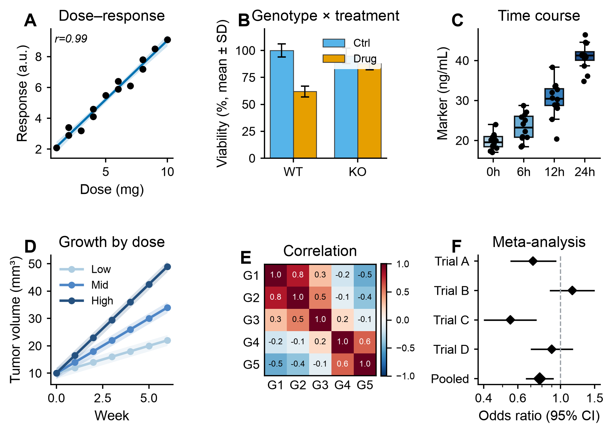

<div align="center">

# 📊 scientific-data-viz

### Real data → publication-ready journal figures. **Exact values, not AI guesses.**

**English** · [한국어](README.ko.md) · [日本語](README.ja.md) · [中文](README.zh.md) · [Español](README.es.md)

<p>
  
  
  
  
  
</p>

A **Claude Code Skill** that turns your data into **Nature / Cell / eLife-style** figures —
**code-rendered** with `matplotlib` so every bar, point, and error bar matches your numbers.



</div>

---

> [!IMPORTANT]
> **This is not an AI image generator.** Image models fabricate bar heights, axes, and
> error bars. This skill *writes plotting code* that renders your **exact** values in a
> clean journal style — and exports an editable vector **PDF** plus a reproducible **script**.

---

## ✨ Features

|  |  |
|---|---|
| 🎯 **Right plot, automatically** | Intent-based guide maps your data's shape to the clearest chart |
| 🧑‍🔬 **Journal house style** | White background, no chrome, bold panel letters, filled points, editable PDF |
| 🔢 **Exact values** | Bars start at zero, error type (SD/SEM/CI) labeled, nothing smoothed or invented |
| 🎨 **20 color palettes** | Colorblind-safe · journal (NPG/AAAS/NEJM/Lancet/JAMA) · many-category (tab20/igv/kelly) |
| 📐 **Legends outside** | Never overlap the data |
| 📈 **Optional statistics** | t / ANOVA / Mann–Whitney / Kruskal / correlation / log-rank / **PERMANOVA**, full test names |
| 🔗 **Table + metadata** | Join a feature table and a metadata file on `sample_id` (omics-style) |
| 📁 **Structured output** | `images/*.png,*.pdf` + `script/*.py` |

---

## 🖼️ Examples

<div align="center">

**A page of the built-in plot catalogue** &nbsp;·&nbsp; **the 20-palette swatch**


</div>

---

## 🤖 What is this?

`scientific-data-viz` is a **Skill** for [Claude Code](https://docs.anthropic.com/en/docs/claude-code) —
you don't run a CLI, you just **describe your data or figure** and Claude loads the skill.
Prompts that trigger it:

```text
"make a publication figure from this CSV"
"draw a journal-style taxonomy bar plot / PCoA"
"plot a Kaplan–Meier / forest plot / heatmap for my paper"
```

---

## 🚀 Installation

**1. Add the plugin to Claude Code**

```bash
/plugin marketplace add chanikyu/sci-co-skills
/plugin install sci-co-skills
```

**2. Python dependencies** (a venv is created on first use, or set it up manually)

```bash
python3 -m venv venv
./venv/bin/pip install -r skills/scientific-data-viz/requirements.txt
```

Requires `matplotlib`, `numpy`, `scipy`, `pandas`, `squarify`.

---

## 🧬 Usage

Describe what you want; the skill runs a fixed workflow:

1. **Ingest & inspect** — types, sample size, paired/longitudinal, uncertainty. Accepts a
   single table **or** a feature table **+ a separate metadata file** joined on `sample_id`.
2. **Pick the plot** via the selection guide (`plot-selection.md`).
3. **Ask which palette** (shows the 20-palette swatch; default `tab20`).
4. **(Optional) statistics** — only when you ask or provide raw replicates.
5. **Render** in journal style, legends outside.
6. **Output** `images/<name>.png` (300 dpi) + `images/<name>.pdf` (vector) + `script/<name>.py`.
7. **Report** which plot, palette, error type, and test were used.

### 📈 Statistics (opt-in) — annotated with the **full test name**

| Situation | Test | Annotation |
|---|---|---|
| 2 groups, independent | Welch's t-test / Mann–Whitney U | `Welch's t-test, t = 7.17, P < 0.001` |
| 2 groups, paired | paired t-test / Wilcoxon signed-rank | `Wilcoxon signed-rank test, W = 3.0, P = 0.002` |
| 3+ groups | one-way ANOVA / Kruskal–Wallis (+ Holm posthoc) | `one-way ANOVA, F(3, 28) = 12.40, P < 0.001` |
| correlation | Pearson / Spearman | `Pearson correlation, r = 0.99, P < 0.001` |
| survival | log-rank | `log-rank test, chi2(1) = 6.1, P = 0.013` |
| beta diversity | **PERMANOVA** | `PERMANOVA, pseudo-F = 27.10, R² = 0.55, P = 0.001` |

Parametric vs non-parametric is auto-decided by a Shapiro–Wilk normality test and reported.
The skill never invents a test or fabricates significance.

---

## 📚 Supported plots

`Comparison` bar+points · dot · grouped bar &nbsp;|&nbsp;
`Distribution` box · violin · raincloud · strip/swarm · histogram · KDE · ECDF &nbsp;|&nbsp;
`Relationship` scatter+fit+CI · bubble · hexbin &nbsp;|&nbsp;
`Trend` line+band · multi-line · area &nbsp;|&nbsp;
`Composition` stacked · 100%-stacked · treemap · pie &nbsp;|&nbsp;
`Ranking` ordered bar · lollipop &nbsp;|&nbsp;
`Paired` slope · difference &nbsp;|&nbsp;
`Effect size` forest / coefficient &nbsp;|&nbsp;
`Matrix` heatmap · clustermap · mosaic &nbsp;|&nbsp;
`Survival` Kaplan–Meier · cumulative incidence &nbsp;|&nbsp;
`Agreement` Bland–Altman &nbsp;|&nbsp;
`Multivariate` PCA · UMAP · PCoA &nbsp;|&nbsp;
`Flow` Sankey/alluvial · chord

The style module works with **any** matplotlib plot — this is just the curated, intent-mapped set.

---

<div align="center">

Made for reproducible science with [Claude Code](https://claude.com/claude-code) · [Apache-2.0](LICENSE) licensed

</div>
