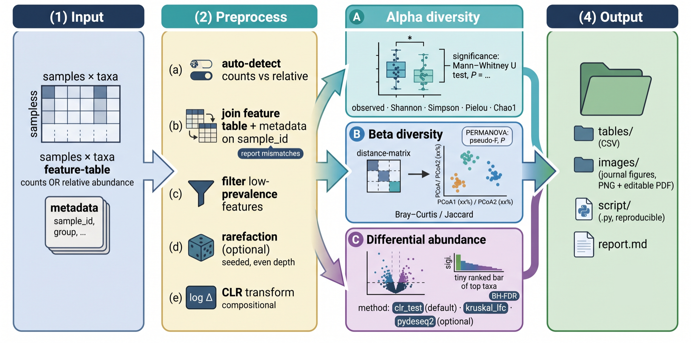
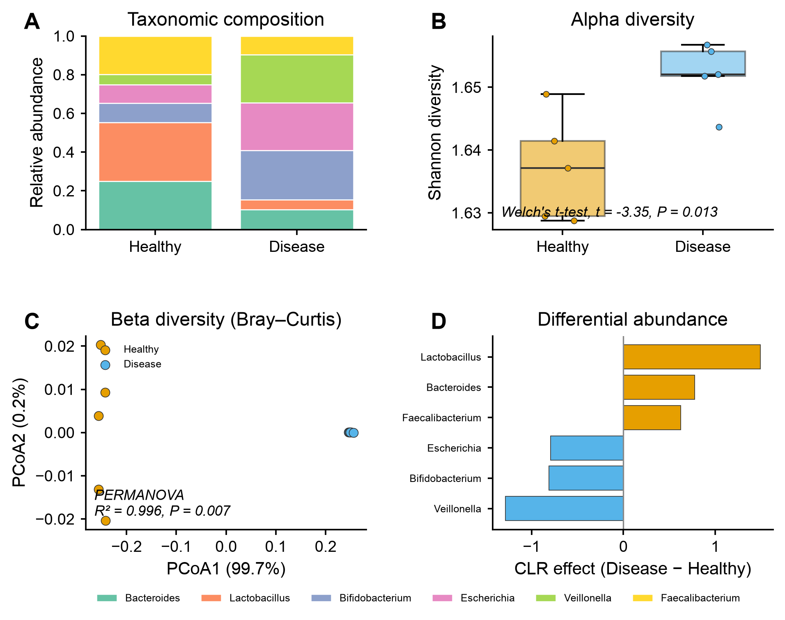

# 🧬 amplicon-analysis

<sub>[← SciCo-Skills](../../README.md) · a skill in the SciCo-Skills suite</sub>

The standard **16S/ITS microbiome** workflow, end to end, from a feature table (counts or
relative abundance) + sample metadata. Diversity/PCoA/PERMANOVA use **scikit-bio**; figures
and full-name statistics reuse **[scientific-data-viz](../scientific-data-viz)**.

<div align="center">

</div>

## 🤖 Use it in Claude

You don't run any Python yourself — **describe your data to Claude** and it runs the whole
pipeline (loads the tables, computes diversity + differential abundance, saves the figures
and `report.md`). For example, just say:

> *"Analyze this feature table + metadata for alpha & beta diversity and differential abundance, grouping by `group`."*
>
> *"run amplicon-analysis on counts.csv + metadata.csv — rarefy to even depth, Bray-Curtis PCoA + PERMANOVA, clr_test"*

Claude confirms the options (metric, rarefaction, DA method), runs it, and points you to the
`tables/`, `images/`, and `report.md` it produced.

## Pipeline

1. **Preprocess** — auto-detect counts vs relative; join on `sample_id` (report mismatches,
   never silently drop); filter low-prevalence features; optional seeded rarefaction; CLR.
2. **Alpha diversity** — observed / Shannon / Simpson / Pielou / Chao1, with a full-name
   group test (parametric vs non-parametric chosen by a Shapiro–Wilk normality test).
3. **Beta diversity** — Bray–Curtis / Jaccard → PCoA (% variance axis labels) → **PERMANOVA**.
4. **Differential abundance** — BH-FDR corrected:
   - `clr_test` (default) — CLR + Mann–Whitney / Kruskal (compositional-aware)
   - `kruskal_lfc` — Kruskal–Wallis + log2 fold-change
   - `pydeseq2` (optional) — DESeq2-style negative-binomial, **counts only**
5. **Output** — `tables/*.csv`, `images/*.png,*.pdf` (alpha box, beta PCoA, DA volcano + bar),
   `script/run_amplicon_analysis.py`, and a plain-language `report.md`.

## Example output

Example 4-panel result from the **full FASTQ → DADA2 → taxonomy → diversity → differential** pipeline on
**synthetic 16S data** (10 samples, Healthy vs Disease) — **A** taxonomic composition (genus), **B** alpha
diversity (Shannon), **C** beta diversity (Bray–Curtis PCoA + PERMANOVA), **D** differential abundance by
genus. Every value is really computed (DADA2 denoise + assignTaxonomy, scikit-bio PCoA/PERMANOVA, CLR + BH-FDR)
and code-rendered exactly by `scientific-data-viz` — the input is **simulated demo data, not a real experiment**.

<div align="center">

</div>

## Run it directly (Python)

The skill runs this for you; you can also run it yourself:

```python
import sys; sys.path.insert(0, "skills/amplicon-analysis")
import analyze
analyze.run(
    feature_table="feature_table.csv",   # samples × taxa (counts or relative); index=sample_id
    metadata="metadata.csv",             # sample_id + group column
    group_col="group",
    out_dir="results",
    da_method="clr_test",                # or "kruskal_lfc", "pydeseq2"
    metric="braycurtis",                 # or "jaccard"
    do_rarefy=False,                     # True (counts only) to rarefy; reported
)
```

## Environment

**scikit-bio requires Python ≤ 3.12.** Create the venv accordingly:

```bash
uv venv --python 3.12 venv
uv pip install --python venv/bin/python -r skills/amplicon-analysis/requirements.txt
```

## Honesty

Methods and thresholds are always stated; multiple testing is corrected; rarefaction is
opt-in and reported (with the compositional alternative offered); Faith PD / UniFrac only
with a supplied tree; significance is never invented. Full rules: **[`SKILL.md`](SKILL.md)**.
