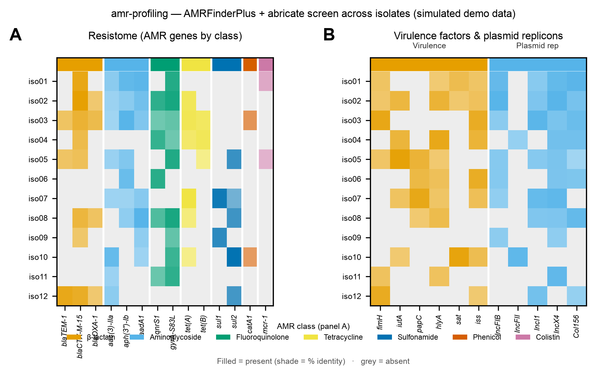

# 🛡️ amr-profiling

<sub>[← SciCo-Skills](../../README.md) · a skill in the SciCo-Skills suite</sub>

Screen one or more **assembled bacterial genomes** for **AMR genes, virulence factors, and
plasmid replicons** — via **AMRFinderPlus** and **abricate**. Input is a contigs FASTA or a
folder of them (batch). Same design as the other SciCo skills: conda-managed tools, structured
output + logs, honest calls.

## What it runs

| Target | Tool | Database |
|---|---|---|
| **AMR** (primary) | AMRFinderPlus | NCBI AMR (`amrfinder -u` / `--amrfinder-db`) |
| **AMR** (secondary) | abricate | CARD / ResFinder (bundled) |
| **Virulence** | abricate | VFDB (bundled) |
| **Plasmid replicons** | abricate | PlasmidFinder (bundled) |

Batch runs get an abricate **presence/absence summary** across genomes per database.

## Example output

Example screen of 12 isolates (**simulated demo data**) — **A** resistome: AMR gene presence/absence
grouped and colored by antibiotic class; **B** virulence factors and plasmid replicons. Shade = %
identity of the hit. Code-rendered by [scientific-data-viz](../scientific-data-viz).

<p align="center">

</p>

## Run it directly (Python)

The skill runs this for you; you can also run it yourself:

```python
import sys; sys.path.insert(0, "skills/amr-profiling")
import pipeline
pipeline.run(
    input_path="assembly.fasta",  # genome/contigs FASTA, or a directory of them
    out_dir="results",
    organism=None,                # e.g. "Escherichia"/"Salmonella" for organism-specific AMR calls
    amrfinder_db=None,            # prebuilt AMRFinderPlus DB path (else tool default)
    threads=4,
)
```

## 🤖 Use it in Claude

> *"Screen these assemblies for AMR, virulence, and plasmids."*
>
> *"amr-profiling on this genome — AMRFinderPlus with --organism Escherichia"*

Input is an **assembly** — only have reads? Assemble first with
[`genome-analysis`](../genome-analysis).

## ⚠️ Notes

- A gene hit predicts **genotype, not clinical phenotype** — the report says so.
- Database + version and identity/coverage thresholds are always reported.
- AMRFinderPlus needs its DB (`amrfinder -u`, or `--amrfinder-db`); missing → skipped with a note.

## Environment

One conda env, **`scico-amr`** (`ncbi-amrfinderplus`, `abricate`) — created on first use (asks
first). Full rules: **[`SKILL.md`](SKILL.md)**.
