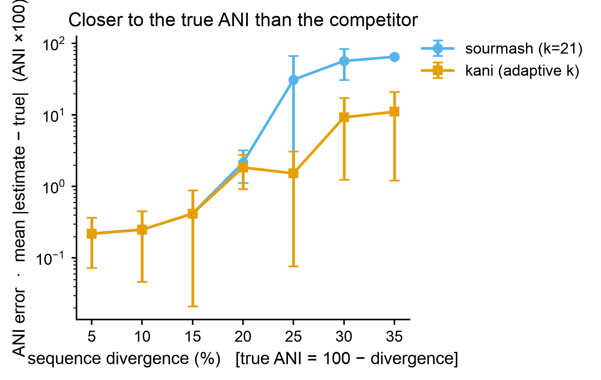

# 🛠️ bioinfo-tool-builder

[← SciCo-Skills](../../README.md) · a skill in the SciCo-Skills suite

Turn a **research goal into a validated, low-friction bioinformatics tool** — mostly
autonomously. It drives research → gap analysis → algorithm design → feasibility proof →
scale-up → **honest benchmark**, using **deep parallel-subagent** analysis of papers and existing
tools, **conda-isolated** development, and **two-lens review** (code + pipeline flow). It interrupts
you **only at 4 critical gates**.

## What it does

- **Deep survey** (parallel subagents): papers + existing tools → the SOTA baseline + the gap.
- **Gates**: G1 evaluable? · G2 **reuse / wrap / build** · G3 **Go/No-Go vs the real competitors** · G4 honest report.
- **Win condition** — the tool must be **closer to the ground truth than the actual competing tools**
  (accuracy is primary; speed/memory secondary; a **one-command CLI + low friction is required**).
- **Honesty** — beats nothing → **STOP**; a win over a trivial *baseline* is never sold as a win over the *competitor*.
- **Simplicity (KISS)** — simplest code that passes the tests; standard libraries and IO formats.

## Example output

A demo run built **`kani`**, an ANI (average nucleotide identity) estimator, and benchmarked it
**head-to-head against the real competitor `sourmash`** on a simulated benchmark with exact truth.
`kani` (adaptive *k*) ties sourmash at low divergence and is **much closer to the true ANI at high
divergence**, where fixed-*k* MinHash breaks — a genuine, net accuracy win.

Example output from a demo run (simulated benchmark, exact truth). Lower = closer to the true ANI.

## 🤖 Use it in Claude

> *"Build a bioinformatics tool that <goal>, more accurate than the existing tools."*

Claude runs the whole pipeline (survey → design → POC → benchmark), sets up conda envs, and reports
at the 4 gates — recommending **reuse** when an existing tool already wins, and **STOP** when nothing
genuinely beats the competitors. Full method: **[`SKILL.md`](SKILL.md)**.
