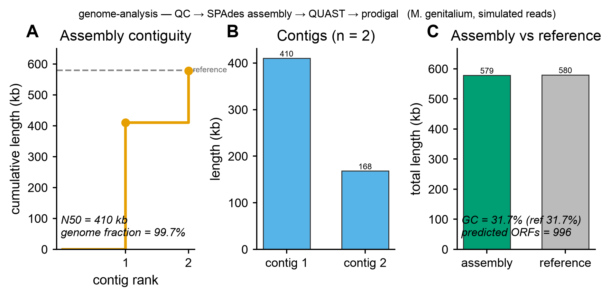

# 🔬 genome-analysis

<sub>[← SciCo-Skills](../../README.md) · a skill in the SciCo-Skills suite</sub>

The standard **bacterial isolate** genome backbone — read QC → assembly → assembly QC →
annotation → species identification — from raw FASTQ or an assembled contigs FASTA. **Same
design as [shotgun-analysis](../shotgun-analysis)**: enter at any stage, conda-managed tools,
user-provided databases, structured output + logs.

## Pipeline

```
raw FASTQ ─(fastp QC)→ trimmed ─(assembler)→ contigs.fasta
  assembler — Illumina: SPAdes / Unicycler / Shovill / SKESA · long: Flye / Canu / Raven · hybrid: Unicycler(+long)
contigs.fasta ┬─(QUAST + CheckM2)→ assembly QC
              ├─(Bakta | Prokka)→ annotation
              └─(GTDB-Tk | fastANI)→ species identification
→ assembly/ qc/ annotation/ species/ logs/ report.md
```

Enter at any stage: **FASTQ → full pipeline; contigs FASTA → from assembly QC onward.**

## 🤖 Use it in Claude

> *"Assemble and annotate this isolate's reads, then identify the species."*
>
> *"run genome-analysis on contigs.fasta — QUAST + CheckM2 + Bakta + GTDB-Tk"*

## Example output

Real run — QC → SPAdes assembly → QUAST → prodigal on simulated reads from a real reference
(*M. genitalium*, 580 kb): **A** assembly contiguity (2 contigs, N50 410 kb, **99.7% of the genome
recovered**), **B** contig sizes, **C** assembly vs reference (matching GC). Code-rendered exactly by
`scientific-data-viz`. (Species ID via GTDB-Tk and CheckM2 use large user-provided DBs — not shown.)

<p align="center">

</p>

## ⚠️ Before you run — cautions

- **Databases are large and user-provided:** **GTDB-Tk ~100 GB**, Bakta ~30–70 GB, CheckM2
  (small). A missing DB → that stage is skipped with a note, never faked.
- **Assembly QC (QUAST + CheckM2) runs before annotation** so you know whether the assembly is
  trustworthy before believing the annotation.
- **Out of scope (separate skills):** MLST / serotyping / cgMLST → [`strain-typing`](../strain-typing);
  AMR / virulence / plasmid → [`amr-profiling`](../amr-profiling).
- **Front stages are not yet verified end-to-end** — standard tool commands; check args against
  your data.

## Environment

One conda env, **`scico-genome`** — created on first use (asks first). Full rules, DB paths, and
assembler options: **[`SKILL.md`](SKILL.md)**.
