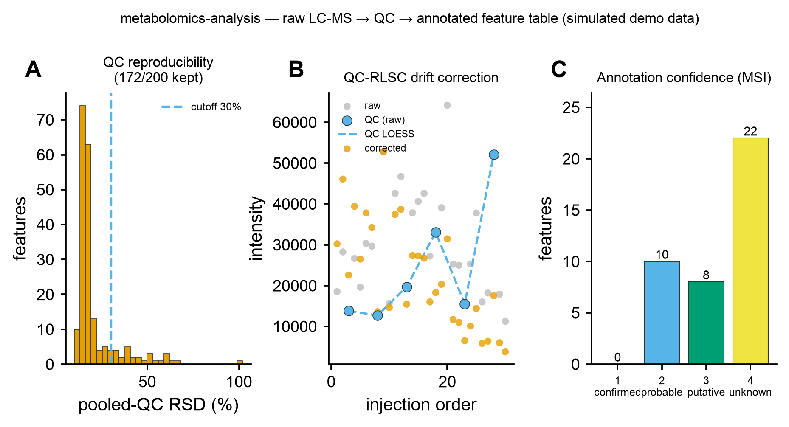

# ⚛️ metabolomics-analysis

<sub>[← SciCo-Skills](../../README.md) · a skill in the SciCo-Skills suite</sub>

The **upstream** untargeted-metabolomics pipeline — raw LC-MS / GC-MS spectra → **annotated feature
table** — the half that [microbiome-metabolome-analysis](../microbiome-metabolome-analysis)
(downstream statistics) assumes is done. Detection → alignment → QC → **annotation**, for **both
LC-MS and GC-MS**. Same design as the other SciCo skills; figures reuse
[scientific-data-viz](../scientific-data-viz). Hands the annotated table to
`microbiome-metabolome-analysis` for stats.

## Pipeline

```
raw (mzML/.CDF) ┬─ LC-MS ── feature detection (asari [Python] / XCMS) → RT alignment → gap-fill → isotope/adduct
                └─ GC-MS ── deconvolution (eRah / MS-DIAL) → retention index (RIAssigner) → EI matching
feature table ─(QC: pooled-QC RSD filter + blank filter + QC-RLSC drift correction)→ clean table
clean table + per-feature spectra ─(annotate: matchms spectral match, precursor-gated → MSI level)→ annotations
→ tables/ (feature_table_clean.csv, annotations.csv) images/ (QC RSD, annotation MSI) logs/ report.md
```

Enter at any stage: **mzML → full; a feature table → QC + annotation; an annotated table → stats.**

## Example output

Real run via the skill on synthetic LC-MS data (30 samples w/ pooled QC + blanks, 200 features) —
**A** pooled-QC RSD filter (reproducibility), **B** QC-RLSC drift correction (raw vs corrected over
injection order), **C** annotation confidence (MSI levels — most features are putative/unknown, the
honest reality). Code-rendered by `scientific-data-viz`; the input is simulated demo data.

<p align="center">

</p>

## 🤖 Use it in Claude

> *"Run metabolomics-analysis on this mzML dir, LC-MS, then annotate with this MoNA library."*
>
> *"QC this feature table (pooled QC + blanks) and drift-correct it → hand to stats"*

## Notes

- **QC order**: blank filter → QC-RLSC drift correction → RSD filter (drift before RSD).
- **Annotation** needs per-feature MS2/EI spectra + a library; **level 2 needs precursor accurate-mass
  agreement** — spectral-only matches are level 3; most untargeted features are level 2–3 (putative).
- **GC-MS deconvolution wraps eRah / MS-DIAL** (no pure-Python option); RI via RIAssigner when an
  alkane/FAME reference is given. env `scico-metabolomics`. Full rules: **[`SKILL.md`](SKILL.md)**.
