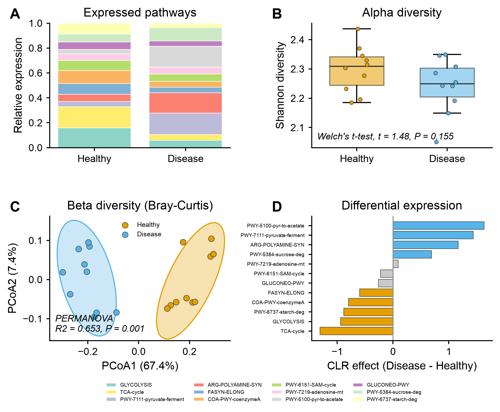

# 🧪 metatranscriptome-analysis

<sub>[← SciCo-Skills](../../README.md) · a skill in the SciCo-Skills suite</sub>

The standard **community RNA-seq (metatranscriptome)** pipeline — QC → host removal → **rRNA removal**
→ functional + taxonomic profiling of the **active** community → differential abundance + diversity —
from raw FASTQ or an abundance table. **Same design as [shotgun-analysis](../shotgun-analysis)** (which
it reuses); the difference is **rRNA depletion (SortMeRNA)** and that profiling is on RNA. Downstream
reuses the [amplicon-analysis](../amplicon-analysis) core; figures reuse
[scientific-data-viz](../scientific-data-viz).

## Pipeline

```
raw FASTQ ─(fastp QC + host removal[opt])→ ─(rRNA removal: SortMeRNA)→ non-rRNA mRNA
mRNA ┬─(HUMAnN)→ pathway / gene-family abundance (function expression)
     └─(MetaPhlAn)→ species abundance (active community)
abundance (functions OR taxa) → CORE (reused): preprocess → alpha → beta (PCoA, PERMANOVA)
                              → differential abundance → tables/ images/ script/ logs/ report.md
```

Enter at any stage: **FASTQ → full; a function/taxonomic abundance table → diversity + differential.**

## Example output

Example from the **tested downstream** on a synthetic pathway abundance table (20 samples, Healthy vs
Disease) — **A** expressed-pathway composition, **B** alpha diversity, **C** beta diversity (Bray–Curtis
PCoA + PERMANOVA, 95% ellipses), **D** differential expression by pathway. Code-rendered exactly by
`scientific-data-viz`; the input is simulated demo data.

<p align="center">

</p>

## Run it directly (Python)

The skill runs this for you; you can also run it yourself:

```python
import sys; sys.path.insert(0, "skills/metatranscriptome-analysis")
import pipeline
pipeline.run(
    input_path="reads/",          # FASTQ dir / abundance table (stage auto-detected)
    metadata="metadata.csv",      # sample_id + condition column
    condition="condition",
    out_dir="results",
    profiler="humann",            # functional/taxonomic profiler
    da_method="clr_test",         # differential abundance test
    metric="braycurtis",          # beta-diversity distance
    threads=4,
)
```

## 🤖 Use it in Claude

> *"metatranscriptome-analysis on this HUMAnN pathabundance table, condition = disease."*
>
> *"community RNA from FASTQ: SortMeRNA rRNA removal → HUMAnN → differential pathways"*

## Notes

- **rRNA removal (SortMeRNA) is essential** for metatranscriptomes; the % removed is reported.
- Abundance here is **expression** of functions/taxa, not just presence.
- DBs (host / rRNA / HUMAnN / MetaPhlAn) are user-provided; env `scico-metatx` on first use.
  Full rules: **[`SKILL.md`](SKILL.md)**.
