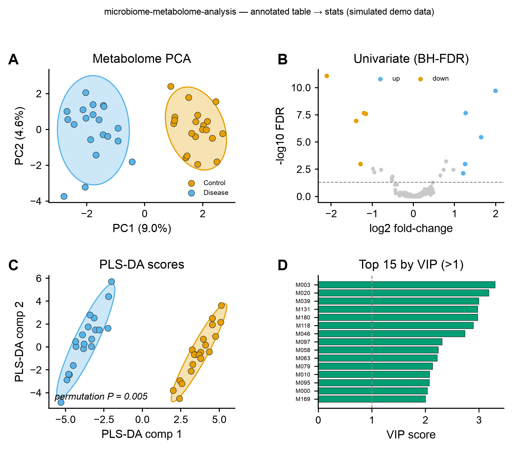

# ⚗️ microbiome-metabolome-analysis

<sub>[← SciCo-Skills](../../README.md) · a skill in the SciCo-Skills suite</sub>

The standard **untargeted-metabolomics statistical workflow** — from an **annotated feature table**
(the MetaboAnalyst "Statistical Analysis" scope; raw peak-picking assumed done) — filtering →
normalization → transform + scale → univariate → multivariate → heatmap → optional enrichment. Same
design as the other SciCo skills: enter at any stage, conda-managed **pure-Python** stats, structured
output + logs. Figures reuse [scientific-data-viz](../scientific-data-viz).

## Pipeline

```
annotated table ─(clean: drop >50% missing → half-min impute → prevalence/variance filter, group-blind)→
   ─(normalize: PQN)→ ─(transform: log)→ ─(scale: Pareto)→
univariate: t / Mann-Whitney (2 grp) · ANOVA / Kruskal (>2) + fold-change → BH-FDR → volcano
multivariate: PCA → PLS-DA + VIP + CV accuracy + permutation test → heatmap (top features)
→ tables/ images/ (PCA, volcano, PLS-DA + VIP, heatmap) script/ logs/ report.md
```

Enter at any stage: **feature table → full; a stats/results table → figures.**

## Example output

Real run via the skill on synthetic data (40 samples × 200 metabolites, Control vs Disease) — **A**
metabolome PCA, **B** univariate volcano (BH-FDR), **C** PLS-DA scores with the honest permutation
*P*, **D** top features by VIP (>1). Code-rendered by `scientific-data-viz`; the input is simulated
demo data.

<p align="center">

</p>

## Run it directly (Python)

The skill runs this for you; you can also run it yourself:

```python
import sys; sys.path.insert(0, "skills/microbiome-metabolome-analysis")
import pipeline
pipeline.run(
    input_path="metabolites.csv", # samples x metabolites table
    metadata="metadata.csv",      # sample_id + group column
    group_col="group",
    out_dir="results",
    impute="halfmin",             # missing-value imputation
    norm="pqn",                   # normalization (probabilistic quotient)
    scale="pareto",               # scaling before multivariate stats
    padj_thr=0.05, lfc_thr=1.0,
)
```

## 🤖 Use it in Claude

> *"Run microbiome-metabolome-analysis on this metabolite table, group = condition."*
>
> *"metabolomics stats: PQN → log+Pareto → PLS-DA + VIP with a permutation test"*

## Notes

- Order is fixed: **filter → PQN → log + Pareto → stats**, all group-blind (no leakage).
- **PLS-DA overfits** — CV accuracy + a permutation test are always reported.
- Enrichment (ORA) is a **separate helper** (`enrichment.ora`, needs KEGG/HMDB IDs), not auto-run.
- Pure Python; env `scico-metabolome` on first use. Full rules: **[`SKILL.md`](SKILL.md)**.
