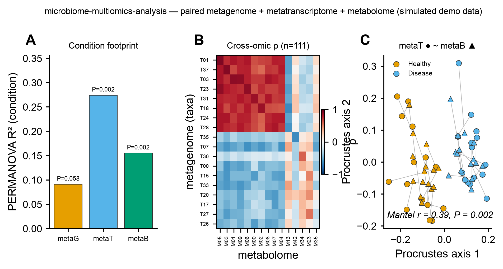

# 🔗 microbiome-multiomics-analysis

<sub>[← SciCo-Skills](../../README.md) · a skill in the SciCo-Skills suite</sub>

**Integrate** two or three paired omics — metagenome (taxa / function), metatranscriptome
(expression), metabolome (metabolites) — on the **same samples** — into one analysis: which layers
carry the condition signal, which features couple across layers, and whether the layers agree. Same
design as the other SciCo skills; figures reuse [scientific-data-viz](../scientific-data-viz). Builds
on the per-omic skills ([shotgun-analysis](../shotgun-analysis),
[metatranscriptome-analysis](../metatranscriptome-analysis),
[microbiome-metabolome-analysis](../microbiome-metabolome-analysis)) — run those first to get each table.

## Pipeline

```
{omic tables} + metadata ─(align samples; report drops)→ per omic ─(CLR [compositional] · log+scale [metabolome])→
 per omic ── PERMANOVA (Aitchison) + dispersion check → condition footprint (R², p) per layer
 cross-omic ── Spearman correlation (A×B) + BH-FDR → significant pairs + bipartite network
 concordance ── Procrustes (PCoA overlay) + Mantel → do the layers arrange samples congruently?
 (optional) MOFA+ shared factors · concatenated-CLR PLS-DA (DIABLO substitute)
→ tables/ images/ (correlation heatmap, PERMANOVA, Procrustes) script/ logs/ report.md
```

## Example output

Real run via the skill on synthetic **paired 3-omics** (30 samples, Healthy vs Disease) — **A**
per-omic PERMANOVA (condition footprint), **B** cross-omic Spearman ρ heatmap (BH-FDR; the coupled
taxa–metabolite block is visible), **C** Procrustes + Mantel concordance. Code-rendered by
`scientific-data-viz`; the input is simulated demo data.

<p align="center">

</p>

## 🤖 Use it in Claude

> *"Integrate this metagenome + metabolome table, condition = disease."*
>
> *"cross-omic correlation network + MOFA factors for these paired omics"*

## Notes

- **Compositional omics are CLR-transformed** before correlation/PERMANOVA (raw relative abundance
  makes spurious negatives); metabolome is log + scaled.
- Cross-omic tests are bounded (prevalence / top-N) and BH-FDR'd **per omic-pair**; the tested count
  is reported. Correlation ≠ causation; < ~20 paired samples is exploratory.
- **DIABLO is R-only** — a concatenated-CLR PLS-DA is offered as the substitute. env `scico-multiomics`.
  Full rules: **[`SKILL.md`](SKILL.md)**.
