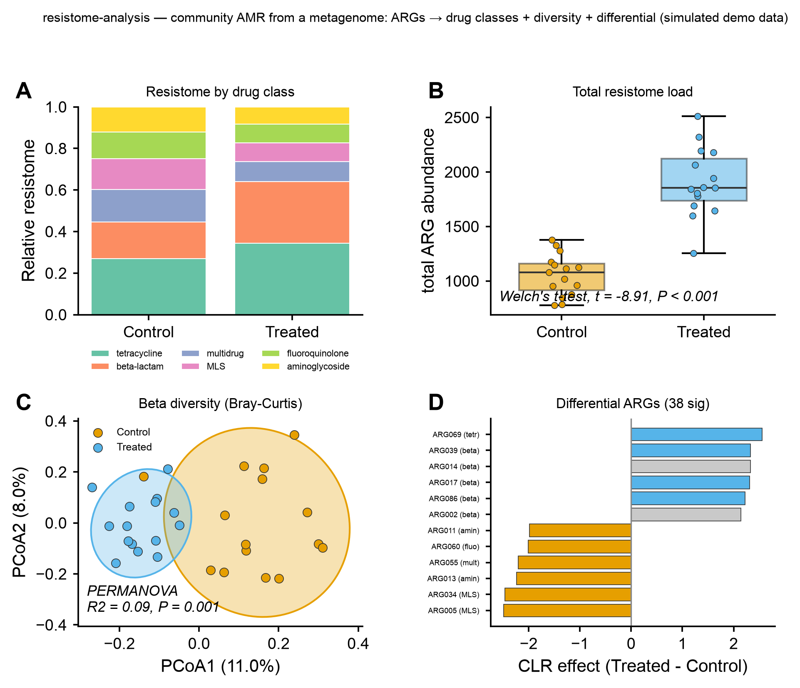

# 💊 resistome-analysis

<sub>[← SciCo-Skills](../../README.md) · a skill in the SciCo-Skills suite</sub>

Profile the **resistome** — the antibiotic-resistance genes (ARGs) of a whole microbial **community** —
directly from a shotgun metagenome's **reads**: detect ARGs → normalize → aggregate to drug classes →
**ARG × samples abundance** → diversity + differential. Distinct from [amr-profiling](../amr-profiling)
(a single isolate genome); here the input is a **community**, quantified from reads. Same design as the
other SciCo skills: enter at any stage, conda-managed tools, user DBs. Downstream **reuses the
[amplicon-analysis](../amplicon-analysis) core**; figures reuse [scientific-data-viz](../scientific-data-viz);
reuses [shotgun-analysis](../shotgun-analysis) QC.

## Pipeline

```
QC'd reads (host-removed) ─(ARG detection: RGI bwt/CARD · DeepARG · AMR++/MEGARes)→ ARG hits
   ─(hAMRonization: harmonize outputs)→ ─(normalize: RPKM + per-single-copy-gene / per-16S)→ ARG × samples
ARG table ┬─(aggregate to drug classes / mechanisms via ARO)→ drug-class × samples summary
          └─ CORE (reused from amplicon-analysis): preprocess → alpha → beta (PCoA, PERMANOVA)
             → differential abundance (which ARGs differ by group)
→ tables/ (arg_abundance.csv, drug_class.csv) images/ logs/ report.md
```

Enter at any stage: **reads → full; hAMRonization reports → normalize + downstream; an ARG table → diversity + differential.**

## Example output

Real downstream via the skill on a synthetic ARG table (30 samples, Control vs antibiotic-Treated) —
**A** resistome by drug class (β-lactam + tetracycline expand under treatment), **B** total ARG load
by group, **C** beta diversity (Bray–Curtis PCoA + PERMANOVA, 95% ellipses), **D** differential ARGs
(CLR effect, labeled by class). Code-rendered by `scientific-data-viz`; the input is simulated demo data.

<p align="center">

</p>

## Run it directly (Python)

The skill runs this for you; you can also run it yourself:

```python
import sys; sys.path.insert(0, "skills/resistome-analysis")
import pipeline
pipeline.run(
    input_path="arg_abundance.csv",  # reads dir / hAMRonization reports / ARG abundance table (auto-detected)
    metadata="metadata.csv",         # sample_id + group column
    group_col="group",
    out_dir="results",
    engine="deeparg",                # "deeparg" (models bundled) | "rgi" (needs CARD)
    da_method="clr_test",            # differential abundance test
    metric="braycurtis",             # beta-diversity distance
)
```

## 🤖 Use it in Claude

> *"resistome-analysis on these reads — DeepARG → normalize → differential ARGs by group."*
>
> *"analyse this ARG abundance table: drug-class composition + diversity + differential"*

## Notes

- **Genotype ≠ clinical phenotype** — a detected ARG predicts hazard, not treatment outcome.
- **The database dominates** — DBs/pipelines disagree **16–45×**; state DB + version + tool + cutoffs.
- Raw counts aren't comparable — **normalize** (RPKM + per-single-copy-gene / per-16S). **ARG richness is
  depth-confounded** → alpha on **rarefied counts**, not RPKM. CLR differential is scale-invariant, so
  per-marker affects Bray–Curtis + the drug-class summary, not the CLR test. env `scico-resistome`
  (DeepARG models bundled; CARD ~200 MB for RGI). Full rules: **[`SKILL.md`](SKILL.md)**.
