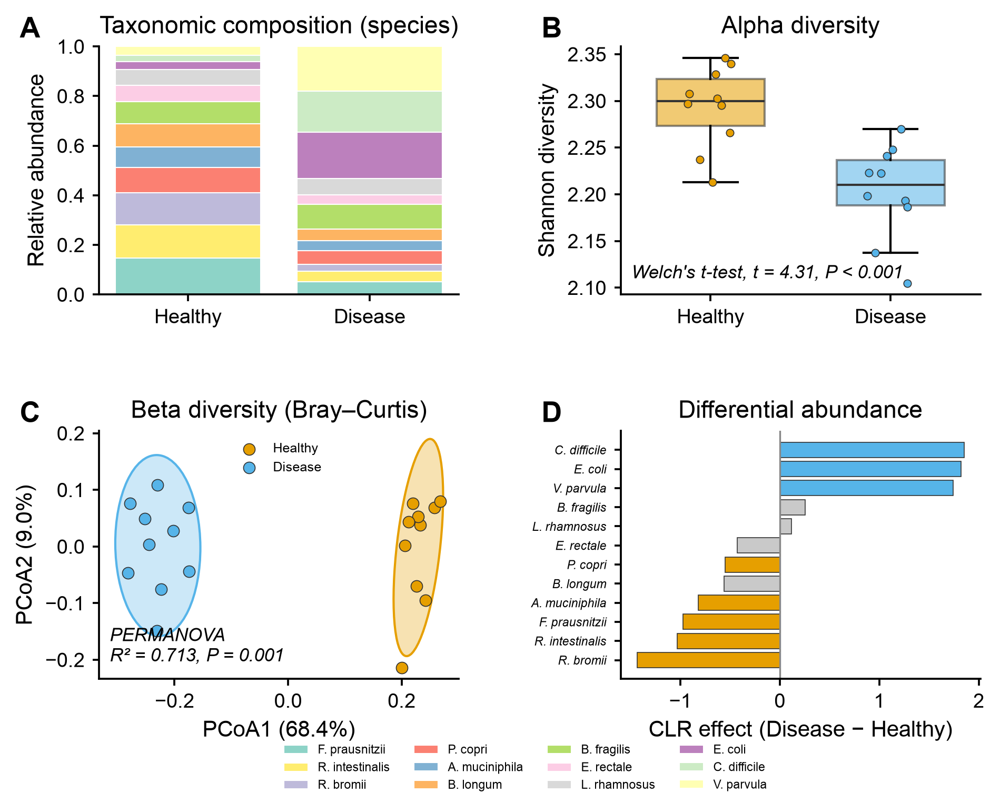

# 🦠 shotgun-analysis

[← SciCo-Skills](../../README.md) · a skill in the SciCo-Skills suite

The standard **shotgun metagenomics** pipeline, end to end — from raw FASTQ or an abundance
table — with the **same design as [amplicon-analysis](../amplicon-analysis)**: enter at any
stage, conda-managed tools, user-provided DBs, structured output. The downstream community
analysis (diversity + differential abundance) **reuses the amplicon-analysis core**; figures
reuse **[scientific-data-viz](../scientific-data-viz)**.

## Pipeline

## 🤖 Use it in Claude

Describe your data and Claude runs the pipeline (env setup, tools, figures). For example:

> *"Run shotgun-analysis on this FASTQ dir with MetaPhlAn, group by `condition`."*
>
> *"metagenome assembly track: MEGAHIT → MAGs (MetaBAT2/CONCOCT/SemiBin2 + DAS_Tool) → GTDB-Tk."*

Pick the track with `track="read"` (default) or `track="assembly"`, and the profiler with
`profiler="metaphlan"` / `"kraken2"`. Entry points: FASTQ → full pipeline; abundance table →
diversity + differential (reused, tested); distance matrix → PCoA + PERMANOVA; alpha table → group test.

## Example output

Example 4-panel result from the **tested downstream** on a synthetic species abundance table
(20 samples, Healthy vs Disease) — **A** taxonomic composition (species), **B** alpha diversity
(Shannon), **C** beta diversity (Bray–Curtis PCoA + PERMANOVA, 95% group ellipses), **D** differential
abundance by species. Code-rendered exactly through `scientific-data-viz`; the input is simulated demo data.

## ⚠️ Before you run — cautions

- **Databases are large and user-provided.** Download them yourself and pass the paths — the
  skill never bundles or silently downloads them:
  - Kraken2 standard DB **~50–100 GB**, **GTDB-Tk ~100 GB** (assembly), HUMAnN DBs (large),
    MetaPhlAn (~few GB), host Bowtie2 index. A missing DB → that optional stage is **skipped**, not faked.
- **The assembly track is compute-heavy.** Assembly (especially co-assembly) can need
  **tens–100+ GB RAM** — run on a workstation/cluster, not a laptop.
- **The conda env is big.** First `scico-shotgun` create pulls many tools (fastp, bowtie2,
  metaphlan, kraken2, humann, megahit, metabat2, concoct, semibin, das_tool, checkm2, gtdb-tk, coverm).

## Environment

One conda env, **`scico-shotgun`** — created on first use (asks first). See
**[`SKILL.md`](SKILL.md)** for the full operating procedure, DB paths, and per-tool options.
