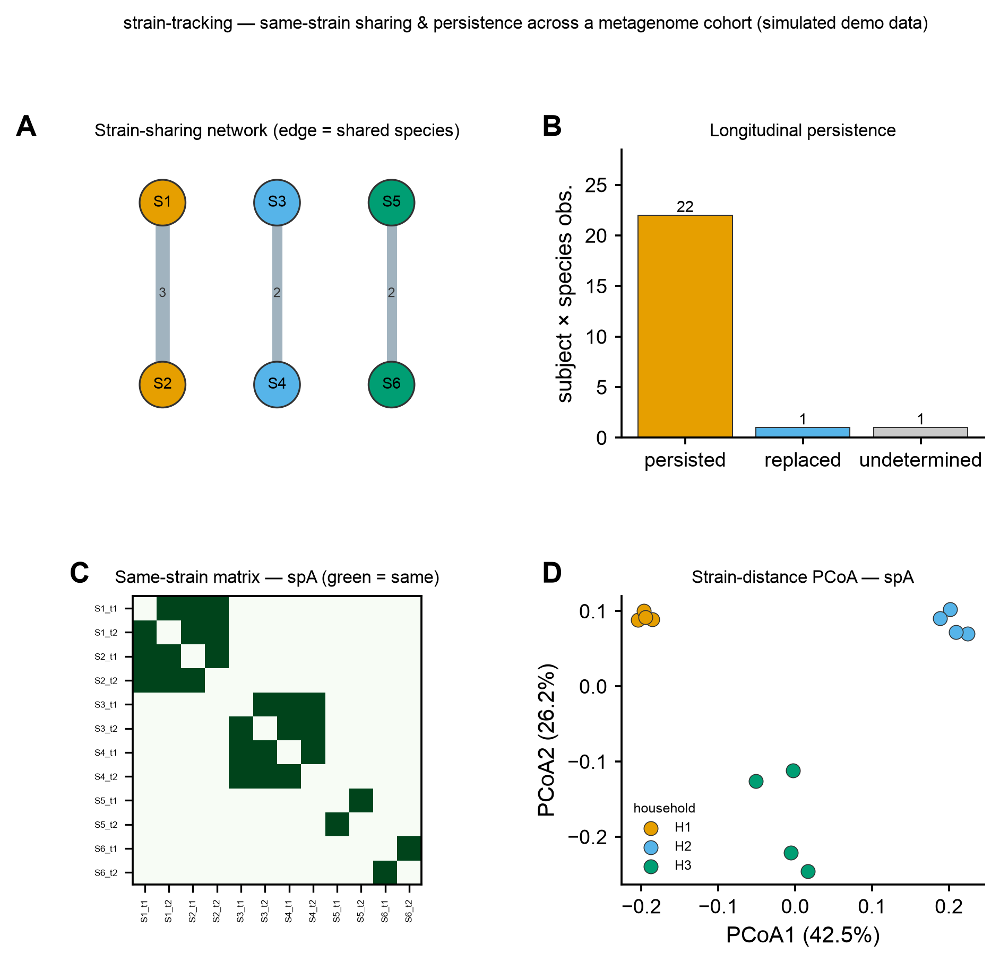

# 🧭 strain-tracking

<sub>[← SciCo-Skills](../../README.md) · a skill in the SciCo-Skills suite</sub>

Follow the **same bacterial strain across samples** in a **multi-sample** shotgun-metagenome cohort —
between individuals (**sharing / transmission**) or within an individual over time (**persistence /
replacement**). Distinct from [strain-typing](../strain-typing) (one isolate genome, MLST/cgMLST): here
the input is a **cohort of metagenomes** and the question is *"is it the same strain in two places?"*.
Same design as the other SciCo skills; reuses [shotgun-analysis](../shotgun-analysis) QC; figures reuse
[scientific-data-viz](../scientific-data-viz).

## Pipeline

```
QC'd reads (many samples) ─(profile: StrainPhlAn 4 [marker, default] · inStrain [popANI, ref/MAG])→
   per-species SNV/marker consensus ─(cross-sample compare)→ per-species strain DISTANCE / identity matrix
matrix ─(threshold "same strain": inStrain popANI ≥ 99.999% · StrainPhlAn nucleotide distance)→ shared pairs
   ┬─ across individuals → strain-SHARING network (networkx: who shares which species)
   └─ within individual over time → PERSISTENCE (retained / replaced / undetermined)
→ tables/ (shared_strains.csv, sharing_edges.csv, persistence.csv) images/ logs/ report.md
```

Enter at any stage: **reads → full; a per-species strain distance matrix → same-strain calls + network + persistence.**

## Example output

Real core via the skill on a synthetic cohort (6 subjects in 3 households × 2 timepoints) — **A**
strain-sharing network (household members share strains; edge = # species shared), **B** longitudinal
persistence (retained / replaced / undetermined), **C** same-strain matrix for one species (blocks =
same strain), **D** strain-distance PCoA by household. Code-rendered by `scientific-data-viz`; the input
is simulated demo data.

<p align="center">

</p>

## Run it directly (Python)

The skill runs this for you; you can also run it yourself:

```python
import sys; sys.path.insert(0, "skills/strain-tracking")
import pipeline
pipeline.run(
    input_path="strain_distance.csv",  # reads dir / per-species strain distance matrix (auto-detected)
    metadata="metadata.csv",           # sample_id + subject / timepoint / group columns
    out_dir="results",
    engine="strainphlan",              # "strainphlan" (marker, default) | "instrain" (popANI)
    metric="distance",                 # "distance" (same if <= threshold) | "identity" (same if >= threshold)
    subject_col="subject",             # cross-subject sharing + within-subject persistence
    time_col="timepoint",              # enables longitudinal persistence
)
```

## 🤖 Use it in Claude

> *"strain-tracking on these metagenomes — StrainPhlAn → who shares strains, by subject."*
>
> *"analyse these per-species strain distance matrices: sharing network + persistence over timepoints"*

## Notes

- **Sharing ≠ transmission** — same strain in two hosts may reflect a shared environment; needs epi context.
- **Species-by-species** — every call is within one species; there is no genome-wide answer.
- **Coverage gates the call** — below breadth/coverage → **undetermined**, not "different" (StrainPhlAn
  breadth ~80%; inStrain ≥50% breadth). State tool + threshold (**popANI ≥ 99.999%** / nucleotide
  distance) + DB. env `scico-straintrack` (StrainPhlAn marker DB ~15 GB). Full rules: **[`SKILL.md`](SKILL.md)**.
