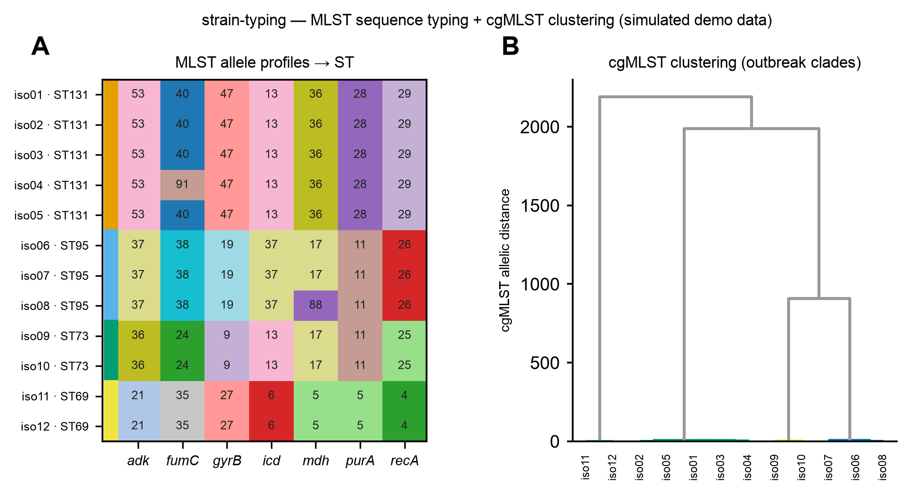

# 🏷️ strain-typing

[← SciCo-Skills](../../README.md) · a skill in the SciCo-Skills suite

Type one or more **assembled bacterial genomes** — **MLST** sequence type, and optionally
**serotyping** and **cgMLST**. Input is a contigs FASTA or a folder of them (batch). Same
design as the other SciCo skills: conda-managed tools, structured output + logs, honest calls.

## What it runs (you pick the level)

| Level | Tool | Notes |
|---|---|---|
| **MLST** (default) | `mlst` | ST + allele profile; schemes bundled, no DB download |
| **Serotyping** (optional) | SISTR / ECTyper | organism-specific (Salmonella / E. coli / …) |
| **cgMLST** (optional) | chewBBACA | needs a user-provided scheme; precise epi typing |

## Example output

Example typing of 12 isolates (**simulated demo data**) — **A** MLST 7-locus allele profiles → sequence
type (ST) calls (isolates with identical profiles group into STs; single-locus variants are shown), **B**
cgMLST allelic-distance clustering into outbreak clades. Code-rendered by
[scientific-data-viz](../scientific-data-viz).

## 🤖 Use it in Claude

> *"MLST-type these assemblies."*
>
> *"strain-typing on this folder of genomes — MLST + SISTR serotyping"*

Input is an **assembly** — only have reads? Assemble first with
[`genome-analysis`](../genome-analysis).

## ⚠️ Notes

- Serotyping is **organism-specific** — only the matching tool is run, and the skill says which.
- Partial / novel / missing alleles are reported; an ST is never forced.
- cgMLST needs a defined scheme path.

## Environment

One conda env, **`scico-typing`** (`mlst`, `sistr_cmd`, `ectyper`, `chewbbaca`) — created on
first use (asks first). Full rules: **[`SKILL.md`](SKILL.md)**.
