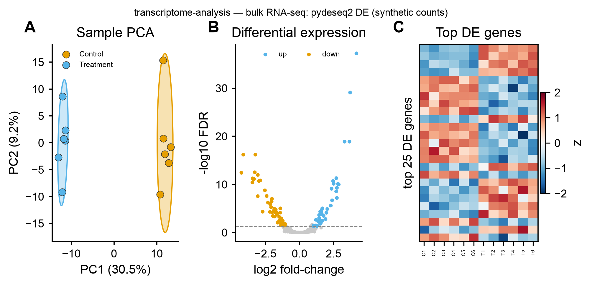

# 📈 transcriptome-analysis

<sub>[← SciCo-Skills](../../README.md) · a skill in the SciCo-Skills suite</sub>

The standard **bulk RNA-seq** pipeline — QC → quantification → **differential expression** →
enrichment — from raw FASTQ or a gene count matrix. Same design as the other SciCo skills: enter at
any stage, conda-managed tools, user-provided references. DE uses **pydeseq2** (DESeq2 model, pure
Python); figures reuse [scientific-data-viz](../scientific-data-viz).

## Pipeline

```
raw FASTQ ─(fastp QC)→ ─(quantify, --aligner salmon | kallisto | star)→ gene × samples counts
counts + metadata ─(pydeseq2: size factors → dispersion → Wald → BH-FDR)→ DE genes ─(enrichment)→
→ tables/ images/ (PCA, volcano, heatmap) script/ logs/ report.md
```

Enter at any stage: **FASTQ → full; a gene count matrix → DE onward; a DE table → figures.**

## Example output

Real **pydeseq2** run on synthetic counts (2000 genes × 12 samples, Control vs Treatment) — **A**
sample PCA (95% ellipses), **B** volcano (DE genes), **C** heatmap (top DE genes). Code-rendered
exactly by `scientific-data-viz`; the input is simulated demo data.

<p align="center">

</p>

## 🤖 Use it in Claude

> *"Run transcriptome-analysis on this count matrix, condition = treatment."*
>
> *"RNA-seq from FASTQ: salmon quant → pydeseq2 DE → volcano + PCA"*

## Notes

- pydeseq2 needs raw **counts** (not TPM/FPKM); low-count genes are filtered and reported.
- Reference index / GTF / gene-sets are user-provided; the conda env `scico-transcriptome` is created
  on first use. Full rules: **[`SKILL.md`](SKILL.md)**.
