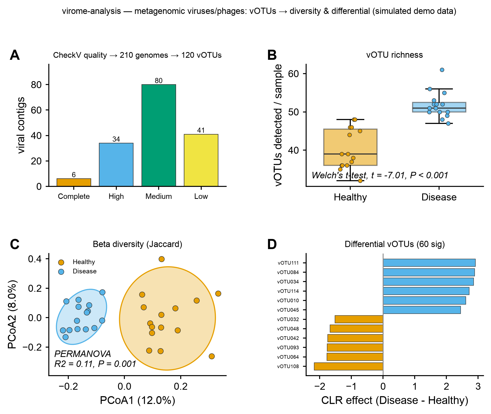

# 👾 virome-analysis

<sub>[← SciCo-Skills](../../README.md) · a skill in the SciCo-Skills suite</sub>

Recover and analyze the **virome** — the viruses and bacteriophages that bacterial profilers
(MetaPhlAn / Kraken) ignore — from a metagenome: identify viral contigs → QC → dereplicate into
**vOTUs** → read-mapped abundance → diversity + differential. Same design as the other SciCo skills:
enter at any stage, conda-managed tools, user-provided DBs. Downstream **reuses the
[amplicon-analysis](../amplicon-analysis) core**; figures reuse [scientific-data-viz](../scientific-data-viz);
builds on [shotgun-analysis](../shotgun-analysis) (assembly).

## Pipeline

```
contigs (≥1.5 kb) ─(geNomad: viral identification)→ ─(CheckV: QC + provirus excision, keep Medium+)→
   ─(dereplicate: 95% ANI / 85% AF, MIUViG)→ vOTUs ─(map reads: CoverM, breadth ≥75%)→ vOTU × samples abundance
abundance → CORE (reused from amplicon-analysis): preprocess → alpha → beta (PCoA, PERMANOVA)
          → differential abundance → tables/ images/ script/ logs/ report.md
```

Optional / external (not auto-run): taxonomy · iPHoP host · BACPHLIP lifestyle · vConTACT3 · VirSorter2.
Enter at any stage: **contigs → full; a vOTU abundance table → diversity + differential.**

## Example output

Real downstream via the skill on a synthetic vOTU table (30 samples, Healthy vs Disease) — **A** CheckV
quality tiers + dereplication (210 genomes → 120 vOTUs), **B** vOTU richness by group, **C** beta diversity
(**Jaccard** PCoA + PERMANOVA, 95% ellipses), **D** differential vOTUs. Code-rendered by `scientific-data-viz`;
the input is simulated demo data.

<p align="center">

</p>

## Run it directly (Python)

The skill runs this for you; you can also run it yourself:

```python
import sys; sys.path.insert(0, "skills/virome-analysis")
import pipeline
pipeline.run(
    input_path="contigs.fasta",   # contigs FASTA / vOTU abundance table (stage auto-detected)
    metadata="metadata.csv",      # sample_id + group column
    group_col="group",
    out_dir="results",
    reads_dir="reads/",           # required at the contigs stage (maps reads for vOTU abundance)
    min_score=0.7,                # geNomad viral-score cutoff
    da_method="clr_test",         # differential abundance test
    metric="braycurtis",          # beta-diversity distance
)
```

## 🤖 Use it in Claude

> *"virome-analysis on these contigs — geNomad → CheckV → vOTUs → map these reads → differential by group."*
>
> *"analyse this vOTU abundance table: Jaccard diversity + differential vOTUs"*

## Notes

- **A vOTU counts as present only above coverage-breadth ≥ 75%** (not one stray read).
- **Host prediction (iPHoP) is low-confidence** and viral taxonomy is coarse — stated, and not auto-run.
- Viral RPKM is **compositional** (CLR handles it; virome tables are sparse → use higher `min_prevalence`);
  richness is **depth-confounded**; report **Jaccard** alongside Bray–Curtis. env `scico-virome` (DBs are
  large: geNomad ~1.4 GB, CheckV ~10 GB, iPHoP ~40 GB optional). Full rules: **[`SKILL.md`](SKILL.md)**.
